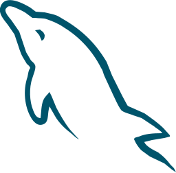

<h1>Helo, World! Tudo bem?</h1>

###

### Sobre Mim 📖
Sou desenvolvedor em constante aprendizado, apaixonado por tecnologia, inovação e design. Criativo, curioso e extrovertido, gosto de explorar novas ideias e transformar problemas em soluções inteligentes. Estou sempre em busca de desafios que me permitam evoluir e contribuir com projetos que façam a diferença.

  
  
  
  
  
  
  
  

###

### Redes Sociais 🔗

##

### Atividades 👨‍💻

  
  

##